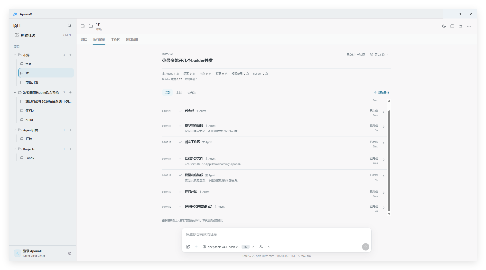
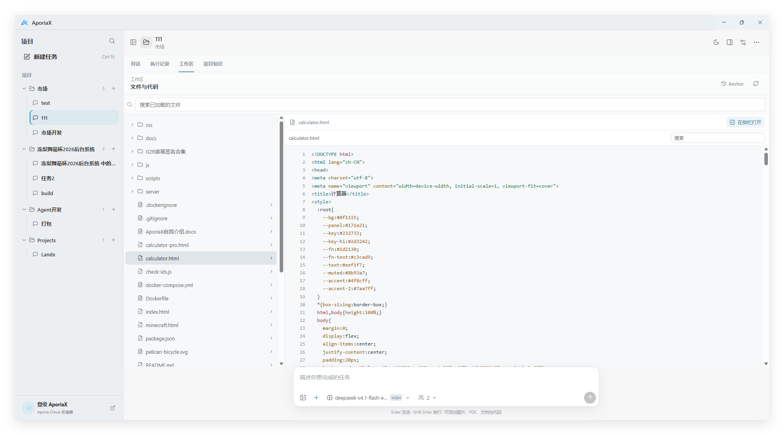
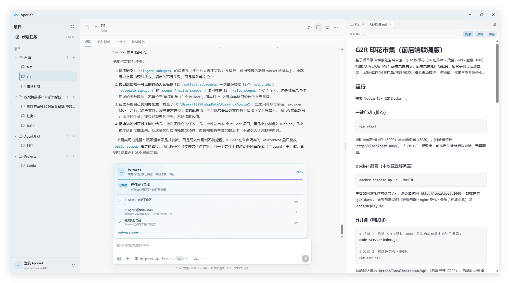
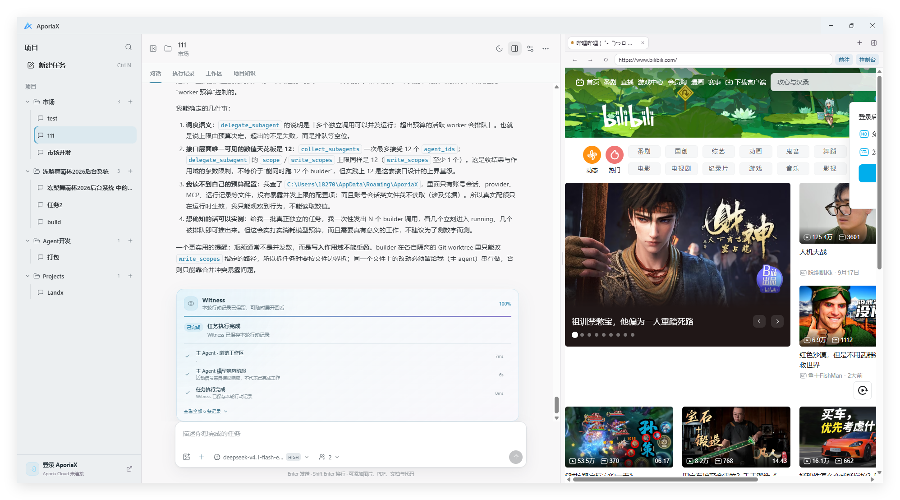
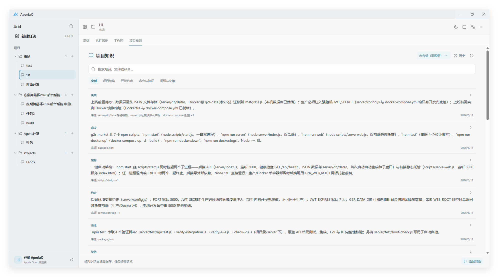

# AporiaX 使用教程

从连接模型开始，让第一个任务真正跑起来。

适用版本：**1.0.0-preview** · 更新：2026-09-22。教程中的按钮名称以简体中文界面为准。Preview 仍有已知问题，不代表所有任务都能无人值守完成。

第一次使用只需先读「添加 API Key」和「第一个任务」。后面的章节可以遇到问题时再查，不必先理解 Agent、MCP 等全部术语。

- [添加 API Key](#api-key)
- [第一个任务](#first-task)
- [认识四个主页面](#main-pages)
- [侧栏：文件、浏览器与终端](#workbench)
- [Git 与 GitHub](#git)
- [项目知识](#knowledge)
- [Skill 与 MCP](#extensions)
- [子 Agent、Builder 与费用](#agents)
- [暂停、恢复与任务状态](#recovery)
- [权限、沙箱与数据安全](#safety)
- [常见问题](#faq)
- [更新与反馈](#updates)

<a id="api-key"></a>

## 01 · 添加 API Key

### 先分清两条连接方式

**使用自己的 API**：在模型服务商处取得 API Key，添加到 AporiaX。费用和可用模型由该服务商决定；不需要先登录 Aporia Cloud。

**使用 Aporia Cloud**：点击左下角「登录 AporiaX」，或模型选择里的「登录 Aporia Cloud」，在浏览器完成授权。未登录时，Cloud 模型显示为灰色，不能直接使用。Aporia Cloud 登录与 GitHub 登录不是同一件事。

下面以自己的 API 为主。不要把 API Key 发到聊天框，也不要在教程网站中填写；它只应填写到桌面应用的 API Key 输入框。

### 第一步：准备 Key、地址与模型

打开你所选服务商的官方 API 控制台，创建 API Key，确认 API 账户可用。需要准备：

| 信息 | 是什么 | 常见填错方式 |
| --- | --- | --- |
| API Base URL | 服务商文档提供的接口基础地址 | 填成聊天网页、登录地址，或完整的 `/chat/completions` 请求地址 |
| API Key | 服务商创建的 API 访问密钥 | 填成账号密码，或把 `Bearer ` 前缀一起粘贴 |
| 请求协议 | 该地址实际支持的 API 格式 | 因模型名称像 Claude 就选择 Anthropic，但中转服务实际只支持兼容协议 |
| 模型 ID | API 接受的准确模型名称 | 填网页显示的昵称，或别家服务商的模型 ID |

可以从 [DeepSeek 官方首次调用说明](https://api-docs.deepseek.com/zh-cn/) 进入其 API Key 申请入口。AporiaX 的「DeepSeek」预设会填入 `https://api.deepseek.com` 和 `DeepSeek native Chat`。官方文档目前列出的 Flash 模型 ID 为 `deepseek-flash`；实际可用型号以你的账户和服务商最新文档为准。

> 第三方转发服务的地址、密钥、协议必须配套，不要只换模型名。转发服务会接收到发送给模型的内容，请先确认来源可信。

### 第二步：打开添加界面

1. 打开 AporiaX，点击窗口左上角的 AporiaX 标志，进入设置。
2. 选择「模型与 API」，点击「新增 API」。
3. 也可以在任务输入框的模型选择菜单中点击「添加自己的 API」，直接进入同一个表单。

无需修改配置文件，也不需要先在终端设置环境变量。

### 第三步：填写并保存

1. 选择对应的「常用服务」预设；其他服务则手动填写。
2. 「名称」填一个方便自己识别的名字，如“我的 DeepSeek”。名称不是模型 ID。
3. 核对「API Base URL」和「请求协议」。如果服务商明确提供 OpenAI 兼容 Chat API，选择 `Chat Completions (compatible)`；原生接口则选择对应协议。
4. 将密钥粘贴到「API Key」。本机无鉴权服务可以留空，云服务通常需要填写。
5. 点击「自动发现」获取模型列表。若服务不支持模型列表接口，可以按其文档**每行手动填写一个模型 ID**。
6. 点击「添加 Provider」。再次编辑已有配置时，API Key 留空表示保持原密钥，不是清除密钥。

**保存按钮灰色？** 先检查地址是否为空，以及是否至少填入一个模型 ID。**自动发现失败？** 不一定是 Key 无效：模型列表接口可能未开放，仍可手动填写后验证。

### 第四步：选中模型，做一次小测试

回到任务，在输入框下方打开模型选择，选择刚添加的服务与模型。只保存 Provider，不代表已切换当前任务的模型。

先发送这段话：

```text
请只回复“连接成功”，不要调用工具，不要读取或修改文件。
```

收到回复说明这次基本对话请求成功；**不等于图片理解、工具调用和长任务全部验证通过**。这次测试也会按服务商规则计费。「自动发现」成功仅代表拿到了模型列表，不代表推理额度充足。

若连接失败，先按[常见问题](#faq)核对报错，不要连续启动长任务反复测试。

<a id="first-task"></a>

## 02 · 第一个任务

1. 准备一个独立文件夹作为练习工作区，不要直接选择整个磁盘或放满个人资料的目录。
2. 点击「新建任务」，选择工作区，给任务命名。尚未配置模型时，按提示先添加 API 或登录 Cloud。
3. 初次体验可保持「项目知识」关闭，避免把无关项目知识带进任务。
4. 选择已验证可用的模型，检查任务设置里的执行方式与审批方式。对权限不确定时先选「手动审批」。
5. 说明目标、允许修改的范围和验证要求。

一个适合练习的请求：

```text
在这个练习目录创建一个 hello.html，显示“你好，AporiaX”。
只创建这一个文件，不安装依赖、不联网、不修改其他文件。
完成后告诉我文件路径，以及你实际做了哪些验证。
```

完成后点击文件链接，在侧栏或工作区查看文件。做真实项目时可以先说：

```text
先阅读项目并说明入口、启动方式和风险，不要改代码、安装依赖或运行测试。
```

清楚的范围比一句“帮我做好”更容易得到可核对的结果。运行命令、安装软件、推送代码等动作，需要看清实际授权范围。

<a id="main-pages"></a>

## 03 · 认识四个主页面

| 页面 | 用来做什么 | 建议重点看什么 |
| --- | --- | --- |
| 对话 | 提需求、补充约束、查看回复和交付物 | 文件链接、修改摘要、未完成项、Witness 执行摘要 |
| 执行记录 | 了解这轮任务实际执行了哪些动作 | 最新记录在上；点详情看工具参数、结果、错误与验证证据 |
| 工作区 | 浏览本地文件树、查看内容与改动 | 当前工作区是否正确；文件可在侧栏打开 |
| 项目知识 | 查看、分类和按需使用长期项目信息 | 知识来源、所属项目、是否已过时 |



执行记录中的“模型响应阶段”表示正在等待或接收模型响应，不是可读的内部思考过程。Agent 激活次数也不是完成度或模型请求次数；Builder 的运行数、排队数和并发上限是另一组信息。



工作区里的 Anchor 默认收起，点击「Anchor」可查看快照。恢复前先确认会影响哪些文件；它不是整个磁盘的备份，也不能代替 Git。

<a id="workbench"></a>

## 04 · 侧栏：文件、浏览器与终端

点击任务右上角的侧栏按钮；空侧栏中选择要打开的工具，也可用标签栏的「+」继续添加。拖动主对话与侧栏之间的分隔线调整宽度。

### 文件与文档

- Markdown 支持「阅读」「源码」和编辑切换，阅读模式会排版标题、表格和代码块。
- 代码文件可以查看语法高亮；编辑后留意是否已经保存。
- Word 可预览格式，但复杂分页、字体和 Office 特性仍应使用 Word 等实际软件复核。
- 图片可在侧栏查看。文件路径必须指向真实文件，且位于授权范围内。



可以对 Agent 说：“把刚生成的文档在侧栏打开。” 不要只凭回复中出现了一个文件名，就认为文件已经成功生成。

### 浏览器

可以打开网页或本地预览地址，与对话并排使用；Agent 的浏览器展示也可以出现在这里。网站登录、验证码和外部站点限制仍可能需要人工处理。



关闭浏览器标签会关闭对应浏览页面，**不等于停止为网页提供服务的终端进程**。例如启动了本地预览服务器，结束后仍需在对应终端中停止它。

### 终端

点击终端内容区后输入命令。`Ctrl+C` 用于中断当前前台命令，通常会返回 Shell 提示符；「清屏」只清除显示，不是结束进程。关闭终端标签会结束对应终端会话，不是把它安全地转入后台。

若 Shell 本身已退出，需重新启动终端会话。复制输出反馈问题前，检查其中有没有密钥、私人路径或账号信息。

### 侧边聊天

用于询问当前任务进度、查看可观察的执行信息，或进行独立聊天，不直接打断主任务。它依赖已有记录与自己的模型配置，不代表能看到主 Agent 尚未返回的内部推理；提问可能产生额外模型费用。

<a id="git"></a>

## 05 · Git 与 GitHub

在空侧栏选择「Git」。Git 是本地版本管理；GitHub 是远程托管服务，二者不是同一件事。

1. 新目录可以初始化仓库；克隆已有仓库应使用空目录，避免覆盖现有文件。
2. 点击当前分支，可新建或切换本地分支。切换前先处理未提交改动，避免打断正在写文件的任务。
3. 修改后查看 Diff，只暂存需要提交的文件，再填写说明并提交。
4. 在仓库设置中配置远程地址和提交署名。若要连接 GitHub，按界面指引通过终端和浏览器完成授权。
5. 核对远程仓库、公开/私有状态与提交内容，再执行推送。

初始化、绑定远程、提交和推送是不同步骤。绑定仓库不代表代码已上传。提交之前排除 `.env`、API Key、个人资料和大体积临时文件。

可以这样提需求：“检查当前 Git 状态，帮我连接到指定仓库，先不要提交或推送。” GitHub CLI 未安装或未登录时，需要先完成界面提示的准备工作。

<a id="knowledge"></a>

## 06 · 项目知识：可选，不是强制记忆

一个工作区可能包含多个项目，项目知识可以按不同知识项目分别保存。它适合记录架构、约定、常用命令与重要决策，不适合保存密码或把整段对话机械复制进去。

1. 打开「项目知识」，点击右上角的当前项目名称，切换或创建知识项目、调整相关设置。
2. 新建任务时选择是否启用，以及使用哪个知识项目；已有任务也可通过任务右键菜单调整。
3. 使用搜索与分类查找内容，点击条目右侧的箭头查看来源与详情。
4. 通过「历史」查看修订；恢复旧版本前先确认内容是否仍适用。



关闭知识功能仍可查看已有知识；启用后模型通过工具按需读取，**不是把整个知识库固定塞进每次请求**。自动整理知识是独立选项，可能消耗模型额度。当前文件和你的最新要求优先于旧知识；过时内容仍需要核对。

<a id="extensions"></a>

## 07 · Skill 与 MCP：扩展做事的方法与工具

**Skill** 是可阅读的工作流说明及其资源，例如文档排版规范。它指导模型怎么做，不是装上就必然提高质量。

**MCP** 是外部工具连接，例如一个本地工具进程或远程服务。它可能需要运行环境、账号和额外权限；不是另一个模型。

打开「设置 → 扩展」：

1. 在「发现」中选择 Skill 或 MCP，搜索需要的能力。
2. 先查看来源、许可证、依赖和权限要求，再选择安装或配置。不要因为能搜到就信任。
3. Skill 也可以导入包含 `SKILL.md` 的本地文件夹；MCP 可以导入 JSON 配置。
4. 在「已安装」中检查状态。MCP 的「探测」可能启动服务或下载依赖；发现工具不代表已验证实际业务操作。
5. 在任务输入框用 `@` 选择扩展，例如 `@skill:名称` 或 `@mcp:标识`。只选当前任务真正需要的扩展。

导入 MCP 不代表立即连接，后续启用和实际调用仍受权限约束。本地 MCP 进程不因出现在扩展列表里就获得操作系统级隔离。不要将带真实凭据的 MCP JSON 发到公开仓库。

<a id="agents"></a>

## 08 · 子 Agent、Builder 与费用

主 Agent 负责理解需求、决定委派、整合与验收。Explore 做探索，Review 做审查，Verify 做验证，Curator 整理知识；Builder 可在限定范围内并行修改。是否启用取决于任务，不是每次都运行全部角色。

Builder 并发可选 **0 / 1 / 2 / 3 / 4 / 6，默认 2**。这是同时运行的 Builder 上限，不是所有 Agent 的总数，也不保证一定启动满额。

建议先用默认值；小任务可设为 0。只有任务可按独立文件范围拆分、模型配额和机器资源也允许时，再提高并发。多个 Builder 反复改同一个文件，可能增加等待与合并成本。

在执行记录中查看每轮激活次数、Builder 当前并发、排队和峰值。完成次数不代表结果全部验收通过。更多 Agent、侧聊、知识整理和重试都可能增加费用；不能仅凭“并发更高”判断效率更好。

<a id="recovery"></a>

## 09 · 暂停、恢复与任务状态

| 情况 | 当前行为与建议 |
| --- | --- |
| 暂时断网、可恢复连接故障 | 进入等待并尝试重连，不必立即新建重复任务 |
| 电脑睡眠后唤醒 | 应用进程仍存活时可继续；睡眠期间不会持续推进任务 |
| 手动暂停 | 需要你手动继续，不会因网络恢复自行解除 |
| 点击停止 | 不会因唤醒或网络恢复复活；先检查已产生的文件和外部动作 |
| 应用退出、崩溃或电脑重启 | 不等同于睡眠，通常需要查看可恢复任务并手动处理 |

保留的是应用已经接收并能够保存的任务状态，不包含模型尚未返回的计算。网络故障前某条命令或上传是否已成功可能无法确定，不应盲目重复执行；重试也可能产生重复费用。

“已交付 · 未验证”表示已有交付但尚无足够验证证据，不等于测试通过。运行失败时先查看错误，保留已生成文件，确认原因后再重试。不要只看百分比或绿色图标判断成品质量。

<a id="safety"></a>

## 10 · 权限、沙箱与数据安全

任务设置中的执行方式与审批方式是两件事：前者决定在哪里执行，后者决定什么动作需要你确认。

| 执行方式 | 边界 |
| --- | --- |
| 直接 / Direct | 在真实工作区执行，修改直接影响文件；不是系统级隔离 |
| 安全 / Safe | 使用临时工作区副本及同步检查；仍使用宿主机的进程与网络权限，不是强沙箱 |
| 隔离 / Isolated | 依赖可用的 Docker 环境，默认断网、只读系统与工作区写入约束；不可用时拒绝，不静默退回普通执行 |

初次接触陌生项目，优先审查来源并使用更保守的审批方式。「全自动审批」不代表没有风险，「安全」字样也不代表任意程序都无害。

本地优先不等于所有内容永不离开电脑：调用云模型时，相关提示词、工具结果和显式提供的内容会发送给所选服务；网页、远程 MCP 等也涉及网络请求。不要提供无关私人文件或生产密钥。

更多边界见 [AporiaX 安全说明](https://github.com/CaptainLand/AporiaX/blob/main/SECURITY.md)。

<a id="faq"></a>

## 11 · 常见问题

### Cloud 模型是灰色，不能发送？

先完成 Aporia Cloud 登录，或添加自己的 API 并选中它。自己的 API 配置成功不等于已登录 Cloud；Cloud 额度不足也不会自动改用你的其他付费服务。

### 自动发现成功，但对话仍失败？

模型列表与对话请求是不同接口。核对当前选中的 Provider、模型 ID、额度、协议和报错正文，再发送最小测试。不要把“已添加”理解为所有能力验证通过。

### 401、402、429、404 或网络错误怎么办？

| 错误线索 | 优先检查 |
| --- | --- |
| 401 / 认证失败 | Key 是否正确、过期、属于当前服务；是否夹带空格或前缀 |
| 余额不足（有些服务使用 402） | API 账户余额或配额；和聊天网页会员可能分开 |
| 429 / 请求过多 | 服务商限流；降低并发、等待恢复，不要持续重试 |
| 404 / 模型不存在 | Base URL、协议与模型 ID；不要重复拼接接口路径 |
| 超时 / 连接失败 | 网络、代理、服务地址；本地模型服务是否已启动 |
| 400 / 参数或协议不兼容 | 请求协议、模型工具能力和服务商实际支持范围 |

错误码含义可能因服务商不同而变化，以报错正文与服务商文档为准。DeepSeek 用户可参考其[官方错误码说明](https://api-docs.deepseek.com/zh-cn/quick_start/error_codes/)。反馈时可以提供错误码与脱敏截图，**不要提供 Key**。

### 文件链接打不开，或者提示路径越界？

先在「工作区」确认文件真实存在，核对所属工作区、文件名与扩展名。跨工作区文件需要相应授权，不要通过关闭边界检查来绕过。可让 Agent 重新核对文件并返回正确链接，而不是反复点击旧路径。

### Markdown 只看到井号和代码？

确认正在使用新版，并切换到「阅读」模式，而不是「源码」。Word 预览和最终 Office 排版不完全等价，正式交付前仍需打开实际文件检查。

### 扩展显示已安装，为什么不能用？

检查是否启用、依赖是否安装、环境变量是否齐全、MCP 探测是否成功，以及任务是否选择了正确扩展。探测成功不表示已经验证写入、发送等实际操作；授权不足时应解决授权问题，不应扩大到无关权限。

### 任务很慢，是不是多开 Builder 就行？

先看执行记录：是在等待模型、外部命令、审批还是网络恢复。连续依赖的任务不能靠并行缩短；盲目增大并发可能更容易限流和增加费用。

<a id="updates"></a>

## 12 · 更新与反馈

在「设置 → 关于 → 检查更新」查看新版本。安装版可下载后重启安装；便携版按提示打开下载页，退出旧版后替换。不要在重要任务写文件时直接强制更新。

1.0.0-preview 保留预览版标识与已知问题。Windows 知识项目、Curator 统计和部分执行记录 UI 检查仍有待修复项，详见[版本说明](https://github.com/CaptainLand/AporiaX/blob/main/docs/RELEASE_NOTES_v1.0.0-preview.md)。

反馈问题时提供：软件版本、安装版/便携版、可重复操作步骤、错误正文，以及脱敏后的截图。避免上传真实 API Key、完整私人会话和机密项目。

- [下载最新版](https://github.com/CaptainLand/AporiaX/releases/latest)
- [提交问题](https://github.com/CaptainLand/AporiaX/issues)
- [项目源码与说明](https://github.com/CaptainLand/AporiaX)

教程是使用说明，不会在网页上调用模型或处理你的 API Key。
